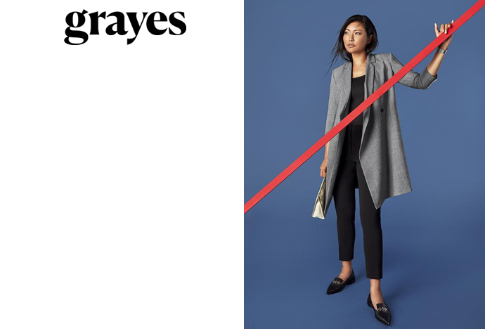

<h3 class="secondary-title case-study">About the Panel </h3>

<strong>Date:</strong> Thursday May 31, 2018

<strong>Time:</strong> 6pm - 8pm

<strong>Location:</strong> WeWork, 240 Richmond St W, Toronto, ON M5V 2C5

This panel looks to discuss different ways that Shopify can be used to create a unique experience for the customer.

As competition grows in the online selling arena, differentiating yourself as a merchant can be highly advantageous.  Allowing customers to customize products or finding interesting ways to share information about the product can often be a key selling factor.

Shopify is continuing to work with merchants and developers to facilitate creating unique experiences that help customers choose.

<h3 class="secondary-title case-study">Panel Speakers</h3> 

	<a href="https://twitter.com/alfalfaanne?lang=en" target="_blank">
		<h3>Anne Thomas</h3>
	</a>
	
As Technical Director of <a href="https://outofthesandbox.com/" target="_blank">Out of the Sandbox</a> Anne is working to make highly customizable themes for merchants of Shopify.

	<a href="https://twitter.com/matthump?lang=en" target="_blank">
		
		<h3>Matt Humphreys</h3>
	</a>
	
As Chief Experience Officer and Principal Consultant at <a href="https://www.diffagency.com/" target="_blank">Diff Agency</a> Matt uses his UX background to streamline the buying process for customers.

	<a href="https://twitter.com/leeshapton?lang=en" target="_blank">
		
		<h3>Leanne Shapton</h3>
	</a>
	
Leanne is on the Apps team at Shopify.  She works at creating tools to facilitate developers in creating custom offering for stores.

	<a href="https://twitter.com/rbnhmll?lang=en" target="_blank">
		
		<h3>Robin Hamill</h3>
	</a>
	
<a href="http://www.robinhamill.com/" target="_blank">Robin</a> is a developer that works with merchants to create unique experiences by adding vuejs (amongst other tools) to Shopify themes.

	<a href="https://twitter.com/stephan_peralta?lang=en" target="_blank">
		
		
		<h3>Stephan Peralta</h3>
	</a>
	
Stephan Peralta is the Founder and Creative Lead of <a href="https://www.sovicreative.com/">Sovi Creative</a>, an innovative Commerce Agency building engaging experiences to help Merchants standout & sell more.

<h3 class="secondary-title case-study">Panel Schedule</h3>
<ul>
	<li class="work-first"><strong>6:00pm</strong> - Welcome and intros</li>
	<li><strong>6:20pm</strong> - Panel
		
A moderated panel discussion.
</li>
	<li><strong>7:20pm</strong> - Q/A period     
		
Ask the panelists your questions.
</li>
	<li><strong>7:40pm</strong> - Networking
	
Chat with other Shopify merchants and partners.
</li>
</ul>

<h3 class="secondary-title case-study">Who are we?</h3>

	<figure>
		
	</figure>

Up at Five is a Toronto based digital agency specializing in ecommerce and data-driven application development.

<h3 class="secondary-title case-study">Our Partners</h3>

		
		
Offer your clients the industry’s leading commerce solution. By partnering with Shopify, you’ll be working with a world-class product that provides your clients with the customized commerce experiences they want now, and in the future.

		
		
WeWork blurb

<h3 class="secondary-title case-study">Get started with Shopify</h3>

Use this link to sign up for Shopify Account and we both win 🙌

