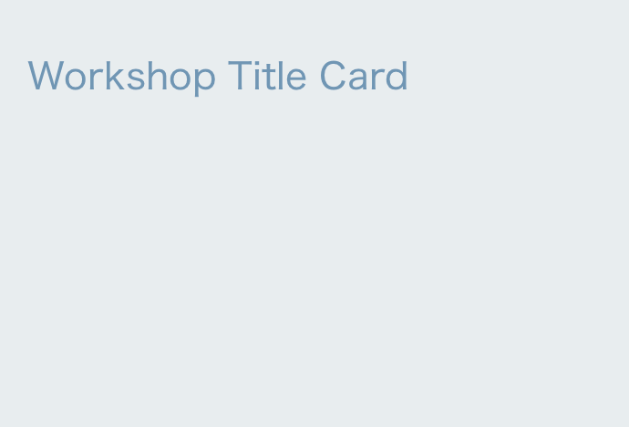

<h3 class="secondary-title case-study">Overview </h3>

An introduction to Shopify theme development, including the file structure, templates, liquid and sections.

<h3 class="secondary-title case-study">About the workshop</h3> 

<strong>Date:</strong> February 19, 2018

<strong>Time:</strong> 6pm - 9pm

<strong>Location:</strong> Wework, Sony Center,  Mitte D, Kemperpl. 1, 10785 Berlin, Germany

This Shopify theme development workshop is targeted at developers who are looking to jump into theme development for ecommerce projects. The workshop will introduce you to a variety of resources you can use to support your development with Shopify.

<h3 class="secondary-title case-study">Who we are</h3>

	<figure>
		
	</figure>

Up at Five is a Toronto based digital agency specializing in ecommerce and data-driven application development.

 <h3 class="secondary-title case-study">Our Partners</h3>

	
	
Offer your clients the industry’s leading commerce solution. By partnering with Shopify, you’ll be working with a world-class product that provides your clients with the customized commerce experiences they want now, and in the future.

		

 <h3 class="secondary-title case-study">Get started with Shopify</h3>

Use this link to sign up for Shopify Account and we both win 🙌

